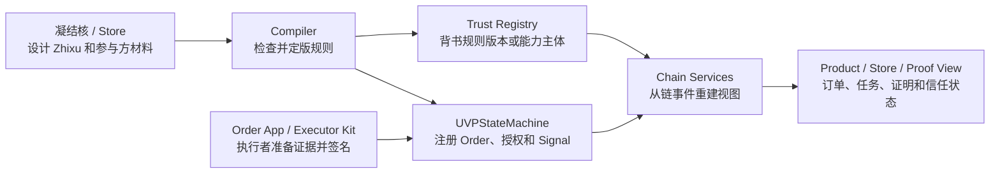

# UVP Wiki

## AI 时代，交易成本仍然存在

AI 正在把“完成一项任务”的成本打下来，但它没有自动消灭交易成本。一个 agent 可以写代码、审单、报价、生成报关材料，企业系统也可以自动执行更多步骤；真正卡住协作的，仍然是另一组问题：该和谁协作，按什么规则协作，谁有资格接下一步，谁能确认结果，确认之后谁负责。

AI 让执行能力变得更便宜，却让协作边界更需要被标准化。人、企业、AI agent、供应商、资金方、审计方和监管方不只是需要“自动化流程”，还需要共同承认同一组事实：某个主体被授权在某个订单、某个阶段、某个证据指纹下发出了某个业务信号，并且这个信号会触发可追责的后果。

UVP（通用价值协议，Universal Value Protocol）的切入点不是再做一个工作流系统，也不是让 AI agent 自己说了算。UVP 把协作规则写成可复用的秩序 DSL，把执行权限、证据指纹、钱包签名和状态后果收束成标准化业务信号，再把关键事实落到链上 proof。

如果你关心的是 AI 时代的协作基础设施、agent 与企业系统如何互相负责、跨组织流程如何降低搜索/议约/监督/争议成本，UVP 的回答是：先把“谁能对什么负责”变成可签名、可验证、可重放的协议事实。

UVP Wiki 是通用价值协议的公开阅读入口。当前可运行实现轨道是 EVM/Web3：可复用的跨组织协作设计会变成被背书的链上 Plan、具体 Order、钱包签名的业务 Signal，以及可重放的 proof。UVP 作为协议可以面向不同链目标；EVM 轨道当前可运行，Solana 边界已预留为明确的 TODO 接口。

第一次阅读时，不需要把所有协议对象一次性记住。先建立一条直觉：秩序 (Zhixu) 是规则书，订单 (Order) 是这次运行，执行者 (Executor) 处理某一步，信号 (Signal) 是带责任的业务声明。Plan、Hook、Source、Product DTO、ABI 等概念会在第二遍和工程页面里展开。

## UVP 要解决什么

UVP 记录协议事实：被某条秩序授权的主体，在某个订单、某个阶段、某个凭证指纹下，声明某个业务信号已经发出，并愿意为这个声明负责。现实真实性、资质审查、担保、保险、争议裁定和监管结论，可以由对应的 trust registry、供应商、资金方、审计方或 adapter 发出自己的信号。

UVP 把复杂生产关系压缩成计算机能理解、链上能记录和追责的秩序语言。`Zhixu` 是“秩序”的拼音，在 UVP 中指一份可复用协作规则书：谁先开始，谁负责下一步，哪个供应商能承接，什么证据算完成，失败时走哪条路。订单 (Order) 是某个秩序版本的一次运行。

秩序 DSL 是低成本的交易约定方式，区块链和智能合约是高伪造成本的记录方式。EVM 实现把两者接起来，让陌生人、企业系统、AI agent、供应商、trust registry 和普通参与者，可以围绕同一套信号边界组织生产。

## 为什么不是只信平台

在单一法域里，一个中心化平台可以成为可信记录方，因为用户对平台的信任通常来自监管机构、司法系统和本地合规责任。跨境协作时，这个前提会变弱：外国用户、银行、监管机构或合作方不天然信任由某一方运营的平台数据库，外国监管机构也未必能直接约束这个平台。

反过来看，如果没有链上事件作为共同事实源，A 方和 B 方争议“谁先提交了某个 signal”时，只能依赖某个平台数据库的日志；而这个数据库可能由其中一方、或其中一方法域内的平台维护。UVP 把授权、签名、证据指纹、提交顺序和状态后果落成可重放链事件，让跨境参与方先拥有一份共同记录。现实真实性、赔付、监管结论和法律责任仍由合同、监管、仲裁、保险、审计或 trust registry 处理。

## 科斯定理的工程实践

UVP 的目标是成为科斯定理在 AI 时代的工程实践：把交易成本拆成可实现的协议对象。

| 交易成本 | UVP 的工程对象 |
| --- | --- |
| 搜索成本 | Store、Supplier registry、trust projection、Product catalog。 |
| 议约成本 | Zhixu DSL、Plan、plan hash、file resources、supplier requirements。 |
| 协调成本 | Source、Signal、Hook、Trigger、Order、executor authorization。 |
| 监督成本 | evidence metadata、payload hash、metadata URI、proof row、timeline。 |
| 集成成本 | Product DTO、Chain Services、executor-kit、adapter/periphery boundary。 |
| 争议和抵赖成本 | EIP-712 签名、`SignalSubmitted`、`HookReady`、trust registry events、replayable chain proof。 |

UVP 定义 AI、企业、人和链上状态如何在同一套可追责边界里协作。

## 当前 EVM 实现

当前 EVM 实现把秩序协作模型接到 EVM 兼容链上。它把秩序设计编译成 deterministic artifact，把计划和供应商背书交给 trust registry，把订单、signal、hook ready 和履约 proof 交给链上状态机。后端负责索引、投影、展示、转发和缓存；对象存储保存链下材料；链上保存 hash、URI、签名和事件。

## 整体数据流

先看全局，再进入细节：



这张图只表达读者要先抓住的方向：Store 和工具组织规则，执行者提交带证据的 signal，合约记录事实，Chain Services 把事实重建成人能读的订单、任务和 proof。

如果你想看浏览器、API、合约、事件、indexer 和数据库如何实际跑起来，读 [架构：实际部署拓扑](concepts/architecture.md#实际部署拓扑)。

编译边界现在收敛为 Zhixu 到 EVM `OnchainHookPlanArtifact` 与 `registerPlan` 参数。旧的平台中立 HookPlan 形状仅作为编译器内部 IR；Solana target stub 已移除，未来链目标需要在 program、索引 adapter、钱包签名和 release evidence 完成后重新定义。

```text
凝结核设计 Zhixu
  -> compiler 生成 deterministic Plan artifacts
  -> trust registry 背书 plan hash
  -> publisher 机制注册 Plan
  -> registrar 机制记录 Order 并写入 signal authorization
  -> 被选中或当选的 executor 或 submitter 签名并提交 Signal
  -> UVPStateMachine 发出 SignalSubmitted / HookReady / status events
  -> Chain Services 从事件重建 Product 和 Store 视图
```

Chain Services 是可重建服务层：它负责索引、投影、校验、转发，并提供 Product / Store API。它不是协议事实源；合约和链事件才是协议事实源，Chain Services 是可重建的投影和转发层。有些协议笔记会把它叫作 non-trusted execution layer，但读者入口应优先使用“可重建服务层”这个名字。

Funding、USDC、escrow、guarantee、settlement 可以围绕这条路径构建，但它们属于 periphery adapter。核心协议边界是协作状态机：Plans、Orders、authorizations、Signals、hooks、attestations 和可重放事件。

## 权威边界图

UVP 把设计、背书、注册、提交、广播和展示分开：

| 问题 | 负责角色或机制 | 协议事实 |
| --- | --- | --- |
| 谁设计可复用规则书？ | 凝结核 / Nucleus，例如采购团队或 workflow owner。 | Zhixu 定义和编译后的 Plan 材料；字段名仍是 `spec.nucleation.id`。 |
| 谁背书 Plan 或 Supplier？ | Trust Domain。 | `PlanAttested`、`SupplierAttested` 和 revocation events。 |
| 谁注册 Plan？ | 授权 publisher 机制或账户。 | `PlanRegistered`。 |
| 谁注册 Order 和初始权限？ | 授权 registrar 机制或账户。 | `OrderRegistered` 和 `SignalSubmitterAuthorized`。 |
| 谁作出业务声明？ | 被选中或当选的 Executor 或授权 submitter 钱包。 | EIP-712 签名和 `SignalSubmitted`。 |
| 谁广播交易？ | Relayer、参与者钱包或集成服务。 | transaction hash 和 event provenance。 |
| 谁展示可读的 order/task/proof 状态？ | Chain Services、Product API、Store、Order App、executor-kit。 | 从链事件重建的 projection。 |

## 公开实现仓库

UVP Wiki 是工作实现的阅读层，UVP 的 EVM/Web3 实现由这些公开仓库组成：

| 仓库 | 负责什么 |
| --- | --- |
| [uvp-protocol](https://github.com/conucleus/uvp-protocol) | Zhixu compiler、HookPlan、state-machine reference、Solidity contracts、ABI、EIP-712、Product DTO。 |
| [uvp-chain-services](https://github.com/conucleus/uvp-chain-services) | 可重建服务层：indexer、relayer、proof verifier、Product API、Store API、projection 和 workflow runtime。 |
| [zhixu-store](https://github.com/conucleus/zhixu-store) | Store / workbench 前端：Zhixu catalog、supplier registry、trust/proof 视图和 operator workflow。 |
| [uvp-order-app](https://github.com/conucleus/uvp-order-app) | 普通参与者 Order App：invite onboarding、task inbox、evidence fingerprint、proof display 和 readiness checks。 |
| [uvp-executor-kit](https://github.com/conucleus/uvp-executor-kit) | Executor CLI/SDK/MCP：executor wallet、chain watcher、Product API signal producer 和 adapter 接入。 |

UVP Wiki 解释这些仓库如何拼成一条链上可证明的协作路径；具体代码、测试和运行脚本在各仓库里。

## 协议边界

UVP 的协议边界是在预先约定的秩序里记录标准化信号责任。参与方对自己发出的信号负责；合约和链事件提供记录；可重建服务和 adapter 围绕这份记录组织展示、提交和集成。UVP 主要降低搜索、议约、协调、监督、集成、争议和抵赖这些交易成本。

| 范围 | UVP 定义 |
| --- | --- |
| 多方协作 | 用链事件记录被授权业务信号及其秩序后果。 |
| 后端工作流 | 后端围绕来自合约和链事件的协议事实做投影和中继。 |
| 资金和结算 | 资金、担保、USDC、escrow 和 settlement 是围绕核心状态机的 adapter。 |
| 业务文件 | 链上保存 hash、URI、签名和事件；业务材料留在链下。 |

UVP Wiki 是协议和当前公开实现轨道的人类阅读入口。它把源码、测试、ABI fixture、PRD 记录和 release evidence 整理成一个可以按路径阅读的项目手册。

## UVP Wiki 给谁看

| 读者 | 你能在这里学到什么 |
| --- | --- |
| 新合作方或生态读者 | UVP 为什么存在，Zhixu/Order/Signal 是什么，一条订单如何被证明。 |
| Product 或 Store 建设者 | Product DTO、Store workflow、supplier registry、proof view、operator action 如何围绕链事实工作。 |
| 协议工程师 | compiler artifacts、contracts、events、EIP-712、hashes、replay 和 public interfaces 如何拼起来。 |
| Executor 或 adapter 接入方 | Order App、executor-kit、enterprise script、AI/MCP、docked Zhixu、periphery adapter 如何提交 signal。 |
| Release owner | local Anvil、Product loop、Base Sepolia staging、状态标签和 release evidence 应该怎么读。 |

## 开始阅读

如果你第一次接触 UVP，按这个顺序读：

1. [一个订单故事](getting-started/one-order-story.md)：用一条跨境货物订单理解从秩序设计到任务 proof 的路径。
2. [核心概念](core/README.md)：在故事清楚之后，按对象层级读 Zhixu、Order、Signal、Executor 和其他协议对象。
3. [一个订单穿过 UVP 组件](getting-started/order-through-components.md)：第二遍再用同一条订单看 Store、compiler、trust registry、state machine、Chain Services、Order App 和 executor-kit 的位置。
4. [核心术语表](reference/glossary.md)：随时查项目术语和关键概念对。

## 按目标选择路径

| 目标 | 接着读 |
| --- | --- |
| 先理解系统再工程 | [入门](getting-started/README.md)、[一个订单穿过 UVP 组件](getting-started/order-through-components.md)、[核心概念](core/README.md)。 |
| 建 Product 或 Store 界面 | [Product DTO 与用户表面](product/README.md)、[秩序商店](store/README.md)、[Order App](execution/order-app.md)。 |
| 改协议或 public interface | [从 Zhixu 到可注册 Plan](components/semantics-and-compiler.md)、[UVPStateMachine](components/onchain-runtime.md)、[公共接口](reference/public-interfaces.md)。 |
| 改 Chain Services 或 Product API | [Chain Services](components/chain-services.md)、[Product API](components/chain-services-product-api.md)、[Product API 参考](reference/product-api.md)。 |
| 接入 executor、企业脚本或 AI/MCP | [执行者与集成](execution/README.md)、[Executor Kit](execution/executor-kit.md)、[Order App 与 Executor Kit](concepts/architecture/components/order-app-executor-kit.md)。 |
| 验证本地或 staging claim | [快速开始](getting-started/quick-start.md)、[Local Anvil 协议闭环](tutorials/local-anvil.md)、[Base Sepolia 预发](tasks/base-sepolia-staging.md)、[项目状态](status/README.md)。 |

完整目录见 [SUMMARY.md](SUMMARY.md)。`wiki/site/` 是静态站点生成输出，不是编辑源。
