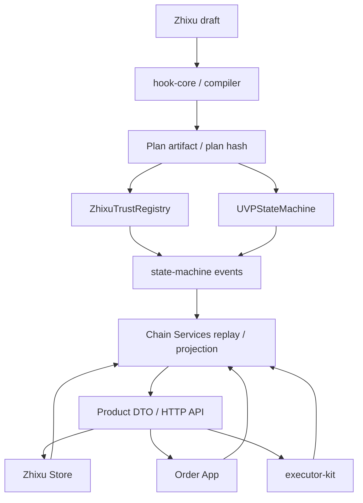

# 架构

UVP EVM 轨道按事实源分层：Zhixu 和 compiler 产生可注册的 Plan，合约和 registry 记录协议事实，Chain Services 从事件重建产品视图，Store、Order App 和 executor-kit 消费这些视图并提交授权动作。



## 分层边界

| 层 | 代码入口 | 负责什么 | 不能负责什么 |
| --- | --- | --- | --- |
| 语义和编译 | `uvp-protocol/packages/hook-core/`、`uvp-protocol/packages/compiler/` | 解析 Zhixu、求值 Hook 语义、生成 deterministic artifact 和 hash。 | 注册订单、保存业务证据明文、替参与者签名。 |
| 链上事实 | `uvp-protocol/contracts/uvp-contracts/` | Plan、Order、Signal、Hook、attestation、deployment cutover 的事实记录。 | Product 展示、Store workflow、私有文件存储。 |
| 可重建服务层 | `uvp-chain-services/service/` | indexer、projection、Product/Store API、relayer boundary、proof/evidence workflow、notifications。 | 成为 plan/order/signal/trust 的事实源，或生成业务签名。 |
| 产品表面 | `uvp-protocol/packages/product-dto/`、`zhixu-store/app/`、`uvp-order-app/app/` | 把链上事实翻译成订单、任务、proof、trust 和 Store 工作台。 | 改写合约事实、绕过 order-level authorization。 |
| 执行者工具 | `uvp-executor-kit/package/` | CLI/SDK/MCP signal producer、chain watcher、Product API prepare/sign/submit/proof。 | 托管默认私钥、替业务方承担签名责任。 |
| 部署和证据 | `uvp-deploy/deploy/` | address manifest、release record、Anvil/Base Sepolia rehearsal、staging gate。 | 重新定义协议语义或隐藏失败证据。 |

## 事实流

```text
Zhixu
  -> Plan artifact / plan hash
  -> PlanAttested / PlanRegistered
  -> OrderRegistered / SignalSubmitterAuthorized
  -> SignalSubmitted / HookStatusChanged / HookReady
  -> replayed Product DTO and proof rows
```

数据库、对象存储、通知队列、Store draft、operator audit 和 submission status 都是投影或 workflow 状态。它们可以提升产品体验，但不能替代 `UVPStateMachine`、`ZhixuTrustRegistry` 和链事件。

## 相关入口

- [一个订单穿过 UVP 组件](../getting-started/order-through-components.md)：用一条订单看组件如何串起来。
- [模块地图](../reference/module-map.md)：查 workspace 目录、职责和禁止职责。
- [公共接口](../reference/public-interfaces.md)：查 ABI、event、EIP-712、hash、DTO 和 release evidence 的漂移检查。
- [合约与事件](../reference/contracts-and-events.md)：查链上接口和事件口径。
