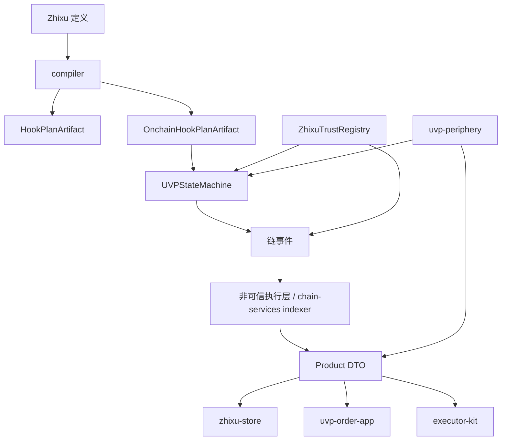

# 架构

`uvp-eth` 按“协议核心、链上事实、非可信执行层、产品表面、执行者工具、部署记录、periphery adapter”分层。层与层之间通过 artifact、ABI、EIP-712 typed data、事件、DTO 和 HTTP API 对接，数据库只保存可重建读模型或 workflow 状态。



## 本篇子项

| 子页 | 说明 |
| --- | --- |
| [模块边界](architecture/modules.md) | 每个目录负责什么、哪些接口是公共边界。 |
| [数据流与事实源](architecture/flow-and-truth.md) | 哪些状态必须来自链，哪些状态只是可重建投影。 |
| [本地到链上路径](architecture/lifecycle.md) | 从 Zhixu 编译、计划认证、订单注册到 Product DTO 的完整生命周期。 |
| [Compiler 与 Hook Core](architecture/components/compiler-hook-core.md) | DSL 解析、Hook 语义、Plan 编译和 deterministic artifact。 |
| [Contracts 与 Registries](architecture/components/contracts-registries.md) | 状态机、trust registry、deployment registry 的边界。 |
| [Product BFF](architecture/components/chain-services-bff.md) | 订单草稿、邀请、参与方确认、授权构建和订单注册提交工作流。 |
| [Store 与治理](architecture/components/store-governance.md) | 秩序商店如何做中心化编目、审核、打标和链上背书请求。 |
| [Order App 与 Executor Kit](architecture/components/order-app-executor-kit.md) | 普通参与者与执行者工具如何消费任务和提交 signal。 |
| [Periphery 与部署](architecture/components/periphery-deploy.md) | adapter/demo 与部署记录如何围绕核心协议运行。 |

## 设计原则

- `uvp-protocol` 产出协议语义、合约、编译器、replay oracle 和共享类型。
- `uvp-chain-services` 是非可信执行层，负责索引、验证、投影、转发；plan/order/signal 的事实源来自链事件。
- `zhixu-store` 和 `uvp-order-app` 展示 Product DTO，普通用户不应理解 hook、ABI、gas 或 trust-domain 内部细节。
- `uvp-executor-kit` 面向执行者、企业脚本、AI/MCP 和 adapter，最终仍然提交链上 signal。
- `uvp-periphery` 可以做资金、担保、AI/MCP、demo，并通过核心接口消费 state-machine signal/proof。

## 组件层级

```text
DSL 和语义层：hook-core / compiler / statemachine reference
链上事实层：UVPStateMachine / ZhixuTrustRegistry / UVPDeploymentRegistry
非可信执行层：chain-services indexer / relayer / proof verifier / Product BFF
中心化治理产品：zhixu-store / Store supplier registry / Store publishing workflow
参与者与执行者：uvp-order-app / uvp-executor-kit
外围适配：uvp-periphery / funding、guarantee、AI/MCP、demo adapters
部署运维：uvp-deploy/deploy / release records / staging gates
```
