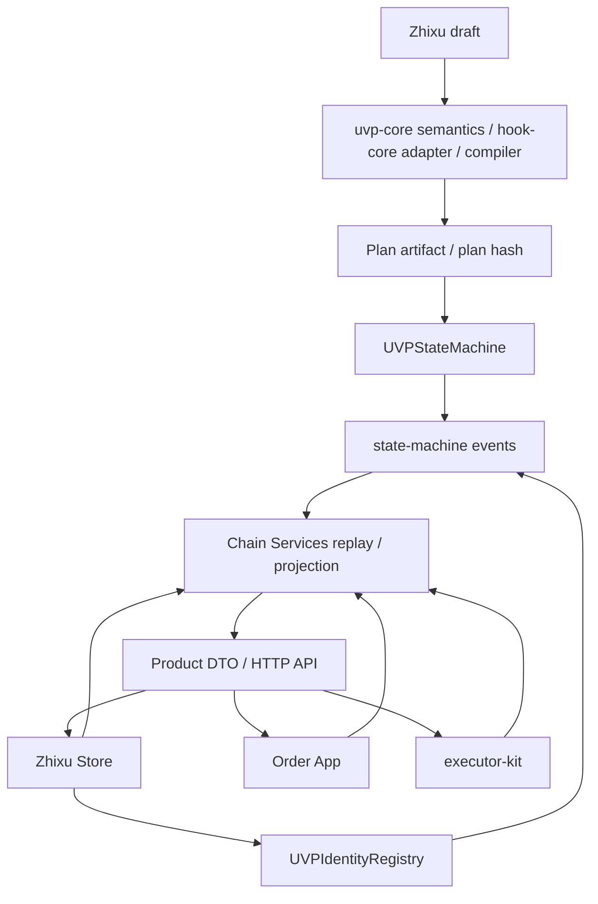
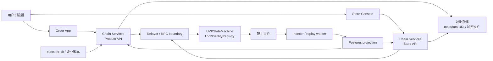

# 架构

UVP EVM 轨道按事实源分层：Zhixu 和 compiler 产生可注册的 Plan，合约和 registry 记录协议事实，Chain Services 从事件重建产品视图，Store、Order App 和 executor-kit 消费这些视图并提交授权动作。

## 实际部署拓扑

概念流说明对象关系；实际运行时，浏览器、API、合约、事件、indexer 和数据库是下面这条回路：

这张图里的 Postgres、对象存储和 API 都是产品运行层。它们可以缓存、检索、展示和中继，但协议事实仍以合约事件、签名、hash、URI 和可重放 event provenance 为准。事实流沿「Zhixu -> Plan artifact -> PlanCommitted/PlanFinalized -> 订单注册与授权 -> Signal/Hook/timer/stage patch/docking 事件 -> 可重放投影」推进；数据库、对象存储、通知队列、Store draft、operator audit 和 submission status 都是投影或 workflow 状态，不能替代 `UVPStateMachine`、`UVPIdentityRegistry` 和链事件。

## 分层边界

| 层 | 代码入口 | 负责什么 | 不能负责什么 |
| --- | --- | --- | --- |
| 语义和编译 | `uvp-protocol/packages/hook-core/`、`uvp-protocol/packages/compiler/` | 解析 Zhixu、求值 Hook 语义、生成 deterministic artifact 和 hash。 | 注册订单、保存业务证据明文、替参与者签名。 |
| 链上事实 | `uvp-protocol/contracts/uvp-contracts/` | Plan、Order、Signal、Hook、身份绑定、deployment cutover 的事实记录。 | Product 展示、Store workflow、私有文件存储。 |
| 服务层（可重建） | `uvp-chain-services/service/`、`uvp-protocol/packages/product-dto/` | indexer、projection、Product/Store API、relayer boundary、proof/evidence workflow、notifications，以及各产品共享的 DTO contract。 | 成为 plan/order/signal/trust 的事实源，或生成业务签名。 |
| 产品表面 | `zhixu-store/app/`、`uvp-order-app/app/` | 把链上事实翻译成订单、任务、proof、trust 和 Store 工作台。 | 改写合约事实、绕过 order-level authorization。 |
| 执行者工具 | `uvp-executor-kit/package/` | CLI/SDK/MCP signal producer、chain watcher、Product API prepare/sign/submit/proof。 | 托管默认私钥、替业务方承担签名责任。 |
| 部署和证据 | `uvp-deploy/deploy/` | address manifest、release record、Anvil/Base Sepolia rehearsal、staging gate。 | 重新定义协议语义或隐藏失败证据。 |

## 组件总线

| 层 | 代码入口 | 事实或接口 |
| --- | --- | --- |
| DSL/语义 | `uvp-protocol/packages/hook-core/`、`uvp-protocol/packages/compiler/` | Hook expression、HookPlan、OnchainHookPlan、planId/planHash。 |
| 链上执行 | `uvp-protocol/contracts/uvp-contracts/` | ABI、events、EIP-712 domain、`UVPStateMachine`、modules、`UVPIdentityRegistry`。 |
| Replay/reference | `uvp-protocol/packages/statemachine/` | reference reducer、event replay、runtime semantic tests。 |
| Bindings | `uvp-protocol/packages/protocol-bindings/` | browser-safe ABI、typed-data builders、hash helpers、calldata builders。 |
| 服务层 | `uvp-chain-services/service/`、`uvp-protocol/packages/product-dto/` | 可 fork 的链下 indexer、projection、relayer boundary、proof verifier、Product/Store API；Product order/task/proof/trust DTO。 |
| Store/Product UIs | `zhixu-store/app/`、`uvp-order-app/app/` | Store workbench、participant task UI、proof display。 |
| Execution tools | `uvp-executor-kit/package/` | CLI/SDK/MCP signal producer。 |
| Deploy/evidence | `uvp-deploy/deploy/` | deployment manifests、release records、staging gates。 |
| Periphery | `uvp-periphery/` | payment/funding/guarantee/agent adapters and demos。 |

## 子页

| 子页 | 说明 |
| --- | --- |
| [数据流与事实源](data-flow-and-truth.md) | 哪些状态必须来自链上，哪些只是可重建投影或操作辅助。 |
| [Plan 与订单生命周期](lifecycle.md) | 从 Zhixu 编译、Plan 发布到订单注册与投影的完整生命周期。 |
| [Compiler 与 Hook Core](compiler-and-hooks.md) | DSL 解析、Hook 语义、确定性编译产物和必须守住的编译语义。 |
| [Contracts 与 Registries](contracts-and-registries.md) | StateMachine、Identity Registry 和 Deployment Registry 的边界。 |
| [Product BFF](product-bff.md) | 订单 draft、invite、参与方确认、授权构建和注册提交工作流。 |
| [Periphery 与部署](periphery-and-deploy.md) | adapter、demo 和部署记录如何围绕核心协议运行。 |

## 架构规则

- 合约和链事件是 plan、order、signal、hook、publication、deployment cutover 的唯一事实源，见 [协议边界](protocol-boundaries.md#事实源)。
- Store、Product API、Order App 和 executor-kit 只能消费、投影、展示、中继或提交授权动作，见 [协议边界](protocol-boundaries.md#产品表面与服务边界)。
- Indexer 和 durable database 必须能从事件重建，不能成为协议事实源，见 [协议边界](protocol-boundaries.md#可重建性)。
- Periphery 可以实现 funding、guarantee、payment、agent adapter，但必须消费核心接口，见 [协议边界](protocol-boundaries.md#外围适配)。
- 任何跨模块改动都要检查 ABI、event、typed data、canonical hash、DTO、CLI 和 release evidence 是否漂移，见 [协议边界](protocol-boundaries.md#公共接口纪律)。

## 相关入口

- [Plan 与订单生命周期](lifecycle.md)：用一条订单看组件如何串起来。
- [模块地图](../reference/module-map.md)：查 workspace 目录、职责和禁止职责。
- [公共接口](../reference/public-interfaces.md)：查 ABI、event、EIP-712、hash、DTO 和 release evidence 的漂移检查。
- [合约与事件](../reference/contracts-and-events.md)：查链上接口和事件口径。
