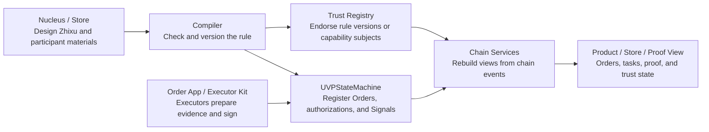

# UVP Wiki

## In the AI Era, Transaction Costs Remain

AI is lowering the cost of doing individual tasks, but it does not erase transaction costs. An agent can write code, inspect documents, quote prices, or generate customs material, and enterprise systems can automate more of the workflow. The hard questions remain: who should work with whom, under which rules, who is allowed to take the next step, who can confirm the result, and who is accountable after confirmation.

As execution gets cheaper, coordination boundaries matter more. Humans, enterprises, AI agents, suppliers, funders, auditors, and regulators still need to agree on the same facts: a subject was authorized to emit a business signal for a specific order, stage, and evidence fingerprint, and that signal carries accountable consequences.

UVP, the Universal Value Protocol, is not just another workflow tool, and it does not let an AI agent become its own source of truth. UVP expresses coordination rules in reusable Zhixu DSL, turns execution permissions, evidence fingerprints, wallet signatures, and state consequences into standardized business signals, and records the key facts as on-chain proof.

If you care about coordination infrastructure for the AI era, about making agents and enterprise systems mutually accountable, or about reducing search, agreement, supervision, and dispute costs across organizations, UVP's answer is simple: turn "who can be accountable for what" into signed, verifiable, replayable protocol facts.

UVP Wiki is the public entry point for the Universal Value Protocol. The runnable implementation track today is EVM/Web3: reusable cross-organization coordination designs become endorsed on-chain Plans, concrete Orders, wallet-signed business Signals, and replayable proof. UVP can target multiple chains as a protocol; the EVM track is working today, and Solana boundaries remain explicit TODO surfaces.

On the first pass, readers do not need to memorize every protocol object. Start with one intuition: Zhixu is the reusable rulebook, Order is the concrete runtime, Executor is the subject that handles a step, and Signal is the accountable business declaration. Plan, Hook, Source, Product DTO, ABI, and related concepts are introduced in the second pass and engineering pages.

## What UVP Solves

UVP records protocol facts: a subject authorized by a specific Zhixu declares, under a specific Order, stage, and evidence fingerprint, that a business Signal has been emitted and that the subject is accountable for that declaration. Real-world truth, qualification review, guarantee, insurance, dispute resolution, and regulatory conclusions can be expressed by the relevant trust registry, supplier, funder, auditor, or adapter as its own signal.

UVP compresses complex production relationships into an order language that computers can interpret and chains can record. `Zhixu` is the transliteration of the underlying Chinese coordination term; in UVP it means a reusable coordination rulebook: who starts, who takes the next step, which supplier may take over, what evidence counts as completion, and where the process goes on failure. An Order is one runtime of a specific Zhixu version.

The Zhixu DSL is a low-cost way to define transaction agreements; blockchains and smart contracts are high-forgery-cost recording systems. The EVM implementation connects the two, so strangers, enterprise systems, AI agents, suppliers, trust registries, and ordinary participants can organize production around the same signal boundary.

## Why Not Just Trust the Platform

Inside one legal jurisdiction, a centralized platform can often serve as the trusted record keeper because users can rely on local regulators, courts, and compliance duties. Cross-border coordination weakens that assumption: foreign users, banks, regulators, and counterparties do not automatically trust a database operated by one side, and a foreign regulator may not be able to directly discipline that platform.

The counterfactual is simple: without chain events as a shared fact source, if party A and party B dispute who submitted a signal first, they must fall back to a platform database log; that database may be maintained by one party or by a platform inside one party's jurisdiction. UVP records authorization, signatures, evidence fingerprints, submission order, and state consequences as replayable chain events, so cross-border participants can start from a common record. Real-world truth, payment, regulatory conclusions, and legal liability still belong to contracts, regulators, arbitration, insurance, audit, or trust registries.

## Coase-Theorem Engineering Practice

UVP aims to be an engineering practice of Coase-style transaction-cost reduction in the AI era. Its engineering goal is to turn transaction costs into implementable protocol objects.

| Transaction cost | UVP engineering object |
| --- | --- |
| Search cost | Store, Supplier registry, trust projection, Product catalog. |
| Agreement cost | Zhixu DSL, Plan, plan hash, file resources, supplier requirements. |
| Coordination cost | Source, Signal, Hook, Trigger, Order, executor authorization. |
| Supervision cost | Evidence metadata, payload hash, metadata URI, proof row, timeline. |
| Integration cost | Product DTO, Chain Services, executor-kit, adapter/periphery boundary. |
| Dispute and denial cost | EIP-712 signatures, `SignalSubmitted`, `HookReady`, trust-registry events, replayable chain proof. |

UVP defines how AI agents, enterprises, humans, and on-chain state coordinate inside the same accountable boundary.

## Current EVM Implementation

The current EVM implementation connects the Zhixu coordination model to EVM-compatible chains. It compiles coordination designs into deterministic artifacts, puts plan and supplier endorsement into a trust registry, and puts Orders, Signals, HookReady events, and fulfillment proof into an on-chain state machine. Backend services index, project, display, relay, and cache; object storage keeps off-chain materials; the chain stores hashes, URIs, signatures, and events.

## Overall Data Flow

Read the whole system once before diving into details:



This diagram only shows the direction a first reader needs: Store and tools organize the rule, executors submit evidence-backed signals, contracts record facts, and Chain Services rebuilds those facts into readable orders, tasks, and proof.

For the concrete browser, API, contract, event, indexer, and database deployment shape, read [Architecture: Runtime Topology](concepts/architecture.md#runtime-topology).

The compiler boundary now converges Zhixu directly into EVM `OnchainHookPlanArtifact` and `registerPlan` arguments. The old platform-neutral HookPlan shape is compiler-internal IR; Solana target stubs have been removed and should be reintroduced only after a program, indexing adapter, wallet signer, and release-evidence path exist.

```text
Nucleus designs a Zhixu
  -> compiler creates deterministic Plan artifacts
  -> trust registry attests the plan hash
  -> publisher mechanism registers the Plan
  -> registrar mechanism records an Order and writes signal authorization
  -> selected executor or submitter signs and submits a Signal
  -> UVPStateMachine emits SignalSubmitted / HookReady / status events
  -> Chain Services rebuilds Product and Store views from events
```

Chain Services is the rebuildable service layer: it indexes, projects, verifies, relays, and exposes Product / Store APIs. It is non-authoritative: contracts and chain events are the protocol fact source, while Chain Services is a rebuildable projection and relay layer. Some protocol notes may call this the non-trusted execution layer, but reader-facing pages should treat "rebuildable service layer" as the primary name.

Funding, USDC, escrow, guarantee, and settlement can be built around this path, but they stay in periphery adapters. The core protocol boundary is the coordination state machine: Plans, Orders, authorizations, Signals, hooks, attestations, and replayable events.

## Authority Map

UVP separates design, endorsement, registration, submission, broadcasting, and display:

| Question | Responsible role or mechanism | Protocol fact |
| --- | --- | --- |
| Who designs the reusable rulebook? | Nucleus, such as a procurement team or workflow owner. | Zhixu definition and compiled Plan materials; the field name remains `spec.nucleation.id`. |
| Who endorses a Plan or Supplier? | Trust Domain. | `PlanAttested`, `SupplierAttested`, and revocation events. |
| Who registers a Plan? | Authorized publisher mechanism or account. | `PlanRegistered`. |
| Who registers an Order and initial permissions? | Authorized registrar mechanism or account. | `OrderRegistered` and `SignalSubmitterAuthorized`. |
| Who makes a business statement? | Selected Executor or authorized submitter wallet. | EIP-712 signature and `SignalSubmitted`. |
| Who broadcasts a transaction? | Relayer, participant wallet, or integration service. | Transaction hash and event provenance. |
| Who displays readable order/task/proof state? | Chain Services, Product API, Store, Order App, executor-kit. | Rebuildable projections from chain events. |

## Public Implementation Repositories

UVP Wiki is the reading layer for a working implementation, and the EVM/Web3 implementation of UVP is split across these public repositories:

| Repository | Responsibility |
| --- | --- |
| [uvp-protocol](https://github.com/conucleus/uvp-protocol) | Zhixu compiler, HookPlan, state-machine reference, Solidity contracts, ABI, EIP-712, and Product DTO. |
| [uvp-chain-services](https://github.com/conucleus/uvp-chain-services) | Rebuildable service layer: indexer, relayer, proof verifier, Product API, Store API, projection, and workflow runtime. |
| [zhixu-store](https://github.com/conucleus/zhixu-store) | Store / workbench frontend: Zhixu catalog, supplier registry, trust/proof views, and operator workflows. |
| [uvp-order-app](https://github.com/conucleus/uvp-order-app) | Participant Order App: invite onboarding, task inbox, evidence fingerprints, proof display, and readiness checks. |
| [uvp-executor-kit](https://github.com/conucleus/uvp-executor-kit) | Executor CLI/SDK/MCP: executor wallets, chain watcher, Product API signal producer, and adapter integration. |

UVP Wiki explains how those repositories fit into one on-chain-provable coordination path; code, tests, and run scripts live in the repositories themselves.

## Protocol Boundaries

UVP's protocol boundary is standardized signal accountability inside a pre-agreed Zhixu. Participants are accountable for the signals they emit; contracts and chain events provide the record; rebuildable services and adapters organize views, submissions, and integrations around that record. UVP mainly reduces the transaction costs of search, agreement, coordination, supervision, integration, dispute, and denial.

| Area | UVP definition |
| --- | --- |
| Multi-party coordination | A protocol that records authorized business signals and their coordination consequences through chain events. |
| Backend workflow | Backends project and relay around protocol facts from contracts and chain events. |
| Funding and settlement | Funding, guarantees, USDC, escrow, and settlement are adapters around the core state machine. |
| Business files | The chain stores hashes, URIs, signatures, and events; business materials stay off chain. |

UVP Wiki is the human-readable entry point for the protocol and its current public implementation tracks. It organizes source code, tests, ABI fixtures, PRD records, and release evidence into a project manual that can be read by path.

## Who UVP Wiki Is For

| Reader | What you can learn here |
| --- | --- |
| New partner or ecosystem reader | Why UVP exists, what a Zhixu/Order/Signal means, and how one order is proven. |
| Product or Store builder | How Product DTOs, Store workflow, supplier registry, proof views, and operator actions fit around chain facts. |
| Protocol engineer | How compiler artifacts, contracts, events, EIP-712, hashes, replay, and public interfaces fit together. |
| Executor or adapter integrator | How Order App, executor-kit, enterprise scripts, AI/MCP, docked Zhixu, and periphery adapters submit signals. |
| Release owner | How local Anvil, Product loops, Base Sepolia staging, status labels, and release evidence should be read. |

## Start Reading

If you are new to UVP, use this order:

1. [One Order Story](getting-started/one-order-story.md): follow one cross-border cargo order from design to task proof.
2. [Core Concepts](core/README.md): after the story is clear, read Zhixu, Order, Signal, Executor, and the rest of the protocol objects by layer.
3. [One Order Through UVP Components](getting-started/order-through-components.md): on the second pass, use the same order to locate Store, compiler, trust registry, state machine, Chain Services, Order App, and executor-kit.
4. [Glossary](reference/glossary.md): keep the project terms and key concept pairs nearby.

## Choose Your Path

| Goal | Read next |
| --- | --- |
| Understand the system before engineering | [Getting Started](getting-started/README.md), [One Order Through UVP Components](getting-started/order-through-components.md), [Core Concepts](core/README.md). |
| Build Product or Store surfaces | [Product DTO and User Surfaces](product/README.md), [Store](store/README.md), [Order App](execution/order-app.md). |
| Work on protocol or public interfaces | [From Zhixu to a Registrable Plan](components/semantics-and-compiler.md), [UVPStateMachine](components/onchain-runtime.md), [Public Interfaces](reference/public-interfaces.md). |
| Work on Chain Services or Product API | [Chain Services](components/chain-services.md), [Product API](components/chain-services-product-api.md), [Product API Reference](reference/product-api.md). |
| Integrate executors, enterprise scripts, or AI/MCP | [Executors and Integrations](execution/README.md), [Executor Kit](execution/executor-kit.md), [Order App and Executor Kit](concepts/architecture/components/order-app-executor-kit.md). |
| Verify local or staging claims | [Quick Start](getting-started/quick-start.md), [Local Anvil Protocol Loop](tutorials/local-anvil.md), [Base Sepolia Staging](tasks/base-sepolia-staging.md), [Project Status](status/README.md). |

See [SUMMARY.md](SUMMARY.md) for the full table of contents. `wiki/site/` is static site build output, not an editing source.
