# Architecture

`uvp-eth` is layered as “protocol core, on-chain facts, rebuildable service layer, product surfaces, executor tools, deployment records, and periphery adapters”. The layers connect through artifacts, ABIs, EIP-712 typed data, events, DTOs, and HTTP APIs. Databases only keep rebuildable read models or workflow state.

```mermaid
flowchart TD
  Z["Zhixu definition"] --> C["compiler"]
  C --> HP["HookPlanArtifact"]
  C --> OHP["OnchainHookPlanArtifact"]
  OHP --> SM["UVPStateMachine"]
  TR["ZhixuTrustRegistry"] --> SM
  SM --> EV["chain events"]
  TR --> EV
  EV --> IDX["rebuildable service layer / chain-services indexer"]
  IDX --> DTO["Product DTO"]
  DTO --> Store["zhixu-store"]
  DTO --> OrderApp["uvp-order-app"]
  DTO --> Exec["executor-kit"]
  Peri["uvp-periphery"] --> SM
  Peri --> DTO
```



## Subpages

| Subpage | Description |
| --- | --- |
| [Module Boundaries](architecture/modules.md) | What each directory owns and which interfaces are public boundaries. |
| [Data Flow and Source of Truth](architecture/flow-and-truth.md) | Which states must come from chain, and which states are only rebuildable projections. |
| [Local-to-Chain Path](architecture/lifecycle.md) | The full lifecycle from Zhixu compilation, plan attestation, and order registration to Product DTOs. |
| [Compiler and Hook Core](architecture/components/compiler-hook-core.md) | DSL parsing, Hook semantics, Plan compilation, and deterministic artifacts. |
| [Contracts and Registries](architecture/components/contracts-registries.md) | The boundaries of the state machine, trust registry, and deployment registry. |
| [Product BFF](architecture/components/chain-services-bff.md) | The workflow for order drafts, invitations, participant confirmation, authorization building, and order registration submission. |
| [Store and Governance](architecture/components/store-governance.md) | How the Zhixu Store does centralized cataloging, review, tagging, and on-chain endorsement requests. |
| [Order App and Executor Kit](architecture/components/order-app-executor-kit.md) | How ordinary participants and executor tools consume tasks and submit signals. |
| [Periphery and Deployment](architecture/components/periphery-deploy.md) | How adapters, demos, and deployment records operate around the core protocol. |

## Design Principles

- `uvp-protocol` produces protocol semantics, contracts, compiler output, replay oracles, and shared types.
- `uvp-chain-services` is the rebuildable service layer, responsible for indexing, verification, projection, and relaying; the source of truth for plan/order/signal comes from chain events.
- `zhixu-store` and `uvp-order-app` present Product DTOs; ordinary users should not need to understand hook internals, ABI, gas, or trust-domain internals.
- `uvp-executor-kit` is for executors, enterprise scripts, AI/MCP, and adapters, but it still submits on-chain signals in the end.
- `uvp-periphery` can provide funding, guarantee, AI/MCP, demo, and related adapters, and it consumes state-machine signal/proof through core interfaces.

## Component Layers

```text
DSL and semantic layer: hook-core / compiler / statemachine reference
On-chain fact layer: UVPStateMachine / ZhixuTrustRegistry / UVPDeploymentRegistry
Rebuildable service layer: chain-services indexer / relayer / proof verifier / Product BFF
Centralized governance product: zhixu-store / Store supplier registry / Store publishing workflow
Participants and executors: uvp-order-app / uvp-executor-kit
Periphery adapters: uvp-periphery / funding, guarantee, AI/MCP, demo adapters
Deployment operations: uvp-deploy/deploy / release records / staging gates
```
