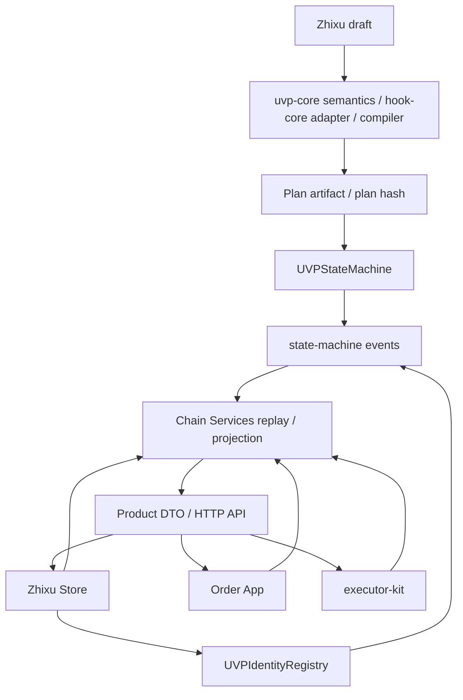
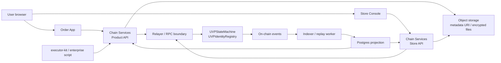

# Architecture

The UVP EVM track is layered by source of truth: Zhixu and the compiler produce registrable Plans, contracts and registries record protocol facts, Chain Services rebuild product views from events, and Store, Order App, and executor-kit consume those views and submit authorized actions.

## Actual Deployment Topology

The conceptual flow explains object relationships; at runtime, browsers, APIs, contracts, events, the indexer, and databases form this loop:

Postgres, object storage, and APIs in this diagram are product runtime layers. They may cache, retrieve, display, and relay, but protocol facts remain contract events, signatures, hashes, URIs, and replayable event provenance. The flow of truth advances along "Zhixu -> Plan artifact -> PlanCommitted/PlanFinalized -> order registration and authorization -> Signal/Hook/timer/stage patch/docking events -> replayable projection"; databases, object storage, notification queues, Store drafts, operator audits, and submission status are all projections or workflow state and cannot replace `UVPStateMachine`, `UVPIdentityRegistry`, or chain events.

## Layered Boundaries

| Layer | Code entry | Responsible for | Not responsible for |
| --- | --- | --- | --- |
| Semantics and compilation | `uvp-protocol/packages/hook-core/`, `uvp-protocol/packages/compiler/` | Parsing Zhixu, evaluating Hook semantics, generating deterministic artifacts and hashes. | Registering orders, storing business evidence plaintext, signing for participants. |
| On-chain facts | `uvp-protocol/contracts/uvp-contracts/` | Fact records for Plans, Orders, Signals, Hooks, identity bindings, and deployment cutovers. | Product display, Store workflows, private file storage. |
| Service layer (rebuildable) | `uvp-chain-services/service/`, `uvp-protocol/packages/product-dto/` | Indexer, projections, Product/Store API, relayer boundary, proof/evidence workflows, notifications, and the DTO contracts shared by products. | Becoming the source of truth for plan/order/signal/trust, or producing business signatures. |
| Product surfaces | `zhixu-store/app/`, `uvp-order-app/app/` | Translating on-chain facts into orders, tasks, proof, trust, and the Store workbench. | Rewriting contract facts, bypassing order-level authorization. |
| Executor tooling | `uvp-executor-kit/package/` | CLI/SDK/MCP signal producer, chain watcher, Product API prepare/sign/submit/proof. | Custodying default private keys, taking over signature responsibility from businesses. |
| Deployment and evidence | `uvp-deploy/deploy/` | Address manifests, release records, Anvil/Base Sepolia rehearsal, staging gates. | Redefining protocol semantics or hiding failure evidence. |

## Component Bus

| Layer | Code entry | Facts or interfaces |
| --- | --- | --- |
| DSL/Semantics | `uvp-protocol/packages/hook-core/`, `uvp-protocol/packages/compiler/` | Hook expressions, HookPlan, OnchainHookPlan, planId/planHash. |
| On-chain execution | `uvp-protocol/contracts/uvp-contracts/` | ABI, events, EIP-712 domain, `UVPStateMachine`, modules, `UVPIdentityRegistry`. |
| Replay/reference | `uvp-protocol/packages/statemachine/` | Reference reducer, event replay, runtime semantic tests. |
| Bindings | `uvp-protocol/packages/protocol-bindings/` | Browser-safe ABI, typed-data builders, hash helpers, calldata builders. |
| Service layer | `uvp-chain-services/service/`, `uvp-protocol/packages/product-dto/` | Forkable off-chain indexer, projections, relayer boundary, proof verifier, Product/Store API; Product order/task/proof/trust DTOs. |
| Store/Product UIs | `zhixu-store/app/`, `uvp-order-app/app/` | Store workbench, participant task UI, proof display. |
| Execution tools | `uvp-executor-kit/package/` | CLI/SDK/MCP signal producer. |
| Deploy/evidence | `uvp-deploy/deploy/` | Deployment manifests, release records, staging gates. |
| Periphery | `uvp-periphery/` | Payment/funding/guarantee/agent adapters and demos. |

## Subpages

| Subpage | Description |
| --- | --- |
| [Data Flow and Source of Truth](data-flow-and-truth.md) | Which states must come from chain, and which are only rebuildable projections or operational aids. |
| [Plan and Order Lifecycle](lifecycle.md) | The full lifecycle from Zhixu compilation and Plan publication to order registration and projection. |
| [Compiler and Hook Core](compiler-and-hooks.md) | DSL parsing, Hook semantics, deterministic compiled artifacts, and the compile-time semantics that must hold. |
| [Contracts and Registries](contracts-and-registries.md) | The boundaries of StateMachine, Identity Registry, and Deployment Registry. |
| [Product BFF](product-bff.md) | Order drafts, invites, participant confirmation, authorization building, and registration submission workflows. |
| [Periphery and Deployment](periphery-and-deploy.md) | How adapters, demos, and deployment records operate around the core protocol. |

## Architecture Rules

- Contracts and chain events are the sole source of truth for plan, order, signal, hook, publication, and deployment cutover; see [Protocol Boundaries](protocol-boundaries.md#事实源).
- Store, Product API, Order App, and executor-kit may only consume, project, display, relay, or submit authorized actions; see [Protocol Boundaries](protocol-boundaries.md#产品表面与服务边界).
- Indexers and durable databases must be rebuildable from events and cannot become a protocol source of truth; see [Protocol Boundaries](protocol-boundaries.md#可重建性).
- Periphery may implement funding, guarantee, payment, and agent adapters but must consume core interfaces; see [Protocol Boundaries](protocol-boundaries.md#外围适配).
- Every cross-module change must check for drift in ABI, events, typed data, canonical hashes, DTOs, CLIs, and release evidence; see [Protocol Boundaries](protocol-boundaries.md#公共接口纪律).

## Related Entries

- [Plan and Order Lifecycle](lifecycle.md): watch how the components chain together through one order.
- [Module Map](../reference/module-map.md): workspace directories, responsibilities, and forbidden responsibilities.
- [Public Interfaces](../reference/public-interfaces.md): drift checks for ABI, events, EIP-712, hashes, DTOs, and release evidence.
- [Contracts and Events](../reference/contracts-and-events.md): on-chain interfaces and event reference.
