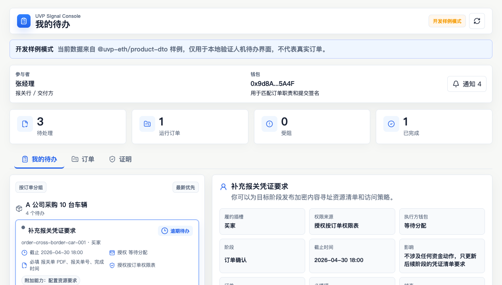
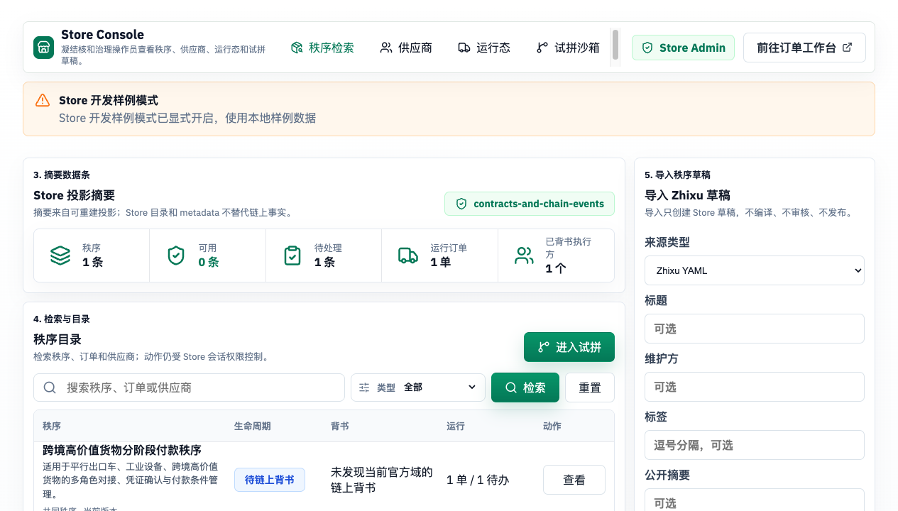

# Product DTO and User Surfaces

> Prerequisite reading: [Protocol Boundaries](../protocol-boundaries.md)
Product DTOs and user surfaces define the object language that ordinary users and product frontends see: orders, tasks, evidence, proof, participants, trust status, and the signal container. They do not carry event replay, indexing, or HTTP runtime; those runtime capabilities belong to [Chain Services](../services/chain-services.md). Product surfaces only care how on-chain projections are expressed as DTOs and consumed by the Store, Order App, and executor-kit.

```text
chain events
  -> rebuildable Chain Services projection
  -> Product DTO
  -> Order App / Store / executor-kit / periphery adapter
```

The most important translation is from DSL stage to Product task:

```text
stage.receiveSignals
  -> compiled Hook
  -> trigger=true
  -> HookReady
  -> ProductTaskDTO
  -> user or executor submits a Signal
  -> Product proof row
```

## Runnable surfaces

Product DTOs land in real runnable product surfaces: the Order App handles to-dos for ordinary participants, while the Store Console lets the Nucleus and operators organize orders, suppliers, trial pairing, and review.



*Order App: the todos, orders, proof, and submission entries an ordinary participant sees.*



*Store Console: the order catalog, trial pairing, supplier, and review entries the Nucleus and operators see.*

## Protocol language and product language

| Protocol language | What a product surface may say |
| --- | --- |
| `OrderRegistered` | The order has been created and is waiting for participants or task progress. |
| `SignalSubmitterAuthorized` | A participant has been allowed to submit a class of action. |
| `HookReady` | A task is now actionable. |
| `SignalSubmitted` | A participant submitted an evidence fingerprint or confirmation action. |
| `HookStatusChanged` | Waiting on a condition, ready, cancelled, or still unmet. |

Ordinary users mainly see orders, tasks, participants, evidence, and proof. Protocol fields such as `sourceId`, `signalId`, `hookId`, gas, and ABI can live in an advanced proof view in service of verifiability.

## User surfaces

| Page | Purpose |
| --- | --- |
| [Product DTO](dto.md) | Ordinary-user order/task/proof/trust DTOs that hide hook and ABI details. |
| [Signal Container](signal-container.md) | The product packaging for task, evidence, typed data, signature, submit, and proof. |
| [Store and Order App](apps.md) | How the Store, Order App, executor-kit, and periphery adapters consume the same Product projection. |
| [Product API Endpoints](../../reference/product-api-endpoints.md) | Current Product API routes and semantics. |

## Boundaries

| Layer | Responsibility |
| --- | --- |
| [Chain Services](../services/chain-services.md) | Rebuild projections from chain events; provide Product API, Store API, relayer, proof verifier, and runtime profile. |
| Product DTO and user surfaces | Define how ordinary users and product frontends express order/task/proof/trust, and define the signal-container data contract. |
| [Order App](../apps/order-app.md) / [Executor Kit](../apps/executor-kit.md) | Consume Product DTOs; prepare evidence, sign, submit, and read proof. |
| [Zhixu Store](../store/README.md) | Consume Product/Store DTOs; organize the Nucleation workbench, suppliers, identity, operator workflow, and audit. |

- Store metadata, drafts, supplier profiles, audit, and JWT sessions belong to the [Zhixu Store](../store/README.md) context and are Nucleation workbench or platform workflow state.
- The Product API can prepare typed data, verify signatures, call the relayer, and return proof; authorization checks are always enforced by contracts. The single authoritative statement of protocol invariants is [Protocol boundaries](../protocol-boundaries.md).
- If a status returned by the Product API cannot be traced to event provenance or metadata explicitly labeled by the Store, it is a product read model or workflow state.
- The executor-kit Product API signal producer and thin MCP adapter belong to [Executor Kit](../apps/executor-kit.md); production runtime, key governance, and live operator runbooks are carried by execution and operations pages.
