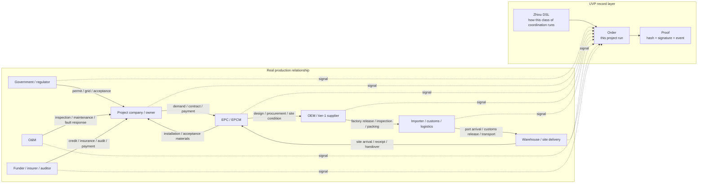

# One Order Story

This page starts from a real production-relationship map, then explains what an Order means in UVP. Keep one sentence in mind first: Zhixu is the static agreement for a class of coordination, and Order is one concrete execution of that agreement.

## 1. A Cross-Border PV Project Is a Production-Relationship Map

Take a Mongolia photovoltaic project as the example. A working project connects policy approval, public EPC, the project company, EPC/EPCM, module and inverter OEMs, import customs clearance, port logistics, warehouse-to-site delivery, installation acceptance, O&M, funders, insurance, auditors, and regulators.

This kind of business is larger than "I have goods, you buy goods." It is a production-relationship map. Government permits affect EPC bidding. EPC demand affects OEM production. Factory documents affect customs clearance. Clearance status affects site installation. Installation records affect acceptance and payment. O&M records affect later responsibility.



Solid lines are real coordination relationships. Dotted lines are business progress written as UVP signals. UVP does not require every company to rebuild its internal system; it standardizes the key coordination boundary into signed, recordable, accountable signals.

## 2. Production Relationships Run on Signals

A production relationship runs because participants keep emitting signals:

- Government or regulators emit permits, filings, grid-connection, and acceptance signals.
- The project company emits demand confirmation, contract confirmation, and payment-arrangement signals.
- EPC/EPCM emits design confirmation, procurement instructions, and site-readiness signals.
- OEMs emit final-spec, sample, tooling, pilot-run, factory-release, and inspection signals.
- Import and logistics parties emit packing, shipment, port arrival, customs release, warehousing, outbound, and site-arrival signals.
- O&M emits installation-complete, inspection, fault-response, and maintenance-complete signals.

A signal answers three questions: who completed what, whether the next step can begin, and who accepts responsibility for the statement.

## 3. Why Signals Have Force

Signals have force because the real world gives them consequences. A payment certificate lets a supplier continue production. A regulatory permit lets a project move to the next stage. Customs documents let cargo be released. Acceptance confirmation starts payment or warranty responsibility. Insurance and audit records make risk computable.

UVP records protocol facts: an authorized subject signs a statement that a business signal has been emitted for a specific Order, stage, and evidence fingerprint. Real-world truth is declared by the responsible person, enterprise, trust domain, auditor, funder, regulator, or adapter through its own signal and accountability. Off-chain facts are declared by real-world responsible parties; the chain records those declarations, signatures, evidence fingerprints, and state consequences.

## 4. Zhixu DSL Writes Production Relationships as Code

The first core move in UVP is to write "production relationship + signal boundary" as computer-readable order language. That order is called `Zhixu`. It is a coordination DSL, with a practical shape close to a YAML agreement.

A PV delivery Zhixu can describe:

```text
who can start
which stages require which evidence
which Suppliers can take which parts
which signals each stage receives
which received signals open the next task
which path handles failure, timeout, rejection, or reassignment
```

Zhixu is the standard language that lets computers, contracts, enterprise systems, AI agents, Store, Order App, and executor-kit understand the same coordination boundary. Real contracts keep defining business responsibility; Zhixu writes the coordination boundary as executable signal rules.

For the core objects, start with [Core Concepts Entry](../core/README.md) and [Zhixu DSL](../concepts/core/zhixu.md).

## 5. From Zhixu to Plan, Then to Order

Read this part as four actions.

### 5.1 Write How This Kind of Project Coordinates

The Nucleation first writes the reusable coordination method for PV project delivery as a Zhixu. It answers ordinary business questions: who starts first, what EPC waits for, when OEM can ship, who is notified after customs release, who can accept after site receipt, and which path handles failure or timeout.

This step is like writing an operating manual in machine-readable YAML. It is not one specific project yet. It is the operating rule for a class of projects.

### 5.2 Freeze the Rule Into a Version

The compiler can be read as "checker and packager". It reads the Zhixu, checks whether references are complete, whether stages and signals line up, and which conditions open which tasks. Then it creates a stable version. That stable version is called a Plan.

A Plan has a `planHash`. You can read it as the fingerprint of this rule set. The same rule set gets the same fingerprint; changes that alter coordination meaning get a new fingerprint. Later review, order registration, and accountability all point to the same version.

### 5.3 A Trust Domain Endorses That Version

A trust domain is a responsible subject willing to endorse a kind of judgment. It can review the Plan materials, evidence requirements, supplier requirements, applicability, and `planHash`. After approval, it emits `PlanAttested` on chain.

`PlanAttested` means this trust domain recognizes this Plan version under its endorsement policy. It gives Store displays, Order creation, and partner review a verifiable basis.

### 5.4 Create This Concrete Run

An Order is one concrete execution of a Plan. For example, when a Mongolia PV project actually procures a batch of modules and delivers them to site, the registrar creates an Order and records who may submit which signals for this Order.

```text
Zhixu DSL: how this class of PV project coordinates
  -> Plan / planHash: stable version and fingerprint of the rule set
  -> PlanAttested: a trust domain endorses this version
  -> OrderRegistered: one project starts running under this version
  -> SignalSubmitterAuthorized: who may emit which signal in this Order
```

From `OrderRegistered` onward, the business is a concrete runtime that can be tracked, signed, supplied with evidence, used to open the next task, and replayed as proof.

## 6. What Changes for Participants

For participants, daily work mostly keeps its existing shape. A manufacturer still finalizes specs, makes samples, opens tooling, runs pilots, and releases goods from the factory. A logistics provider still books shipment, transports, clears customs, and delivers. EPC still organizes design, procurement, installation, and acceptance.

UVP standardizes the signal boundary. When you complete an agreed action in a stage, you submit the evidence fingerprint and sign a signal with the authorized wallet. When other participants' signals arrive, UVP follows the Zhixu agreement and opens your ready task.

```text
instruction
  -> execution
  -> evidence fingerprint
  -> signed signal
  -> SignalSubmitted
  -> HookReady
  -> next task
```

A complex production relationship becomes a readable path: who was authorized, what was done, what evidence fingerprint was submitted, who signed, which chain event exists, and why the next step can begin.

## Read Next

- [Actor Map](actor-map.md): map real PV-project roles to UVP roles.
- [Evidence and Proof Path](evidence-proof-path.md): see how business files become hashes, signed signals, chain events, and Product proof rows.
- [Glossary](../reference/glossary.md): keep Zhixu, Order, Signal, Hook, Trigger, Supplier, and Executor nearby.
