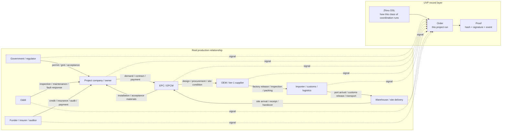

# One Order Story

This page starts from a real production-relationship map, then explains what an Order means in UVP. Keep one sentence in mind first: Zhixu is the static agreement for a class of coordination, and Order is one concrete execution of that agreement.

The goal here is business intuition, not every engineering object. After this page, you should be able to explain who coordinates, who executes a step, which statement moves the order forward, and why that statement is accountable.

## 1. A Cross-Border PV Project Is a Production-Relationship Map

Take a Mongolia photovoltaic project as the example. A working project connects policy approval, public EPC, the project company, EPC/EPCM, module and inverter OEMs, import customs clearance, port logistics, warehouse-to-site delivery, installation acceptance, O&M, funders, insurance, auditors, and regulators.

This kind of business is larger than "I have goods, you buy goods." It is a production-relationship map. Government permits affect EPC bidding. EPC demand affects OEM production. Factory documents affect customs clearance. Clearance status affects site installation. Installation records affect acceptance and payment. O&M records affect later responsibility.



Solid lines are real coordination relationships. Dotted lines are business progress written as UVP signals. UVP does not require every company to rebuild its internal system; it standardizes the key coordination boundary into signed, recordable, accountable signals.

## 2. Production Relationships Run on Signals

A production relationship runs because participants keep emitting signals:

- Government or regulators emit permits, filings, grid-connection, and acceptance signals.
- The project company emits demand confirmation, contract confirmation, and payment-arrangement signals.
- EPC/EPCM emits design confirmation, procurement instructions, and site-readiness signals.
- OEMs emit final-spec, sample, tooling, pilot-run, factory-release, and inspection signals.
- Import and logistics parties emit packing, shipment, port arrival, customs release, warehousing, outbound, and site-arrival signals.
- O&M emits installation-complete, inspection, fault-response, and maintenance-complete signals.

A signal answers three questions: who completed what, whether the next step can begin, and who accepts responsibility for the statement.

In role terms, these production organizations are capable participants first. When one of them is selected or elected to handle a concrete Order stage, it becomes the Executor or submitter for that stage. A government, regulator, funder, insurer, auditor, broker, EPC, or OEM does not become a special UVP role just because of its industry name.

## 3. Why Signals Have Force

Signals have force because the real world gives them consequences. A payment certificate lets a supplier continue production. A regulatory permit lets a project move to the next stage. Customs documents let cargo be released. Acceptance confirmation starts payment or warranty responsibility. Insurance and audit records make risk computable.

UVP records protocol facts: an authorized subject signs a statement that a business signal has been emitted for a specific Order, stage, and evidence fingerprint. Real-world truth is declared by the responsible participant or selected Executor through its own signal and accountability. Off-chain facts are declared by real-world responsible parties; the chain records those declarations, signatures, evidence fingerprints, and state consequences.

## 4. Zhixu DSL Writes Production Relationships as Code

The first core move in UVP is to write "production relationship + signal boundary" as a computer-readable rulebook. That rulebook is called `Zhixu`. It is a coordination DSL, with a practical shape close to a YAML agreement.

A PV delivery Zhixu can describe:

```text
who can start
which stages require which evidence
which participants can take which parts
which signals each stage receives
which received signals open the next task
which path handles failure, timeout, rejection, or reassignment
```

Zhixu is the standard language that lets computers, contracts, enterprise systems, AI agents, Store, Order App, and executor-kit understand the same coordination boundary. Real contracts keep defining business responsibility; Zhixu writes the coordination boundary as executable signal rules.

For the core objects, start with [Core Concepts Entry](../core/README.md) and [Zhixu DSL](../concepts/core/zhixu.md).

## 5. From Rulebook to One Order

Read this part as four actions.

### 5.1 Write How This Kind of Project Coordinates

The Nucleus first writes the reusable coordination method for PV project delivery as a Zhixu. In this story, Nucleus can be read as the team or organization that owns this reusable operating model, such as a procurement operations team, industry program owner, or platform-side workflow designer. It answers ordinary business questions: who starts first, what EPC waits for, when OEM can ship, who is notified after customs release, who can accept after site receipt, and which path handles failure or timeout.

This step is like writing an operating manual in machine-readable YAML. It is not one specific project yet. It is the operating rule for a class of projects.

### 5.2 Freeze the Rule Into a Version

The system first checks and packages the Zhixu: whether references are complete, whether stages and signals line up, and which conditions open which tasks. Then it creates a stable version.

That stable version has a fingerprint. The same rule set gets the same fingerprint; changes that alter coordination meaning get a new fingerprint. Later review, order registration, and accountability all point to the same version.

### 5.3 Publish the Version and Register Participant Identities

The publisher signs the stable version through EIP-712. StateMachine records the Plan hash, metadata, and publisher as replayable events. A Store may review the material and decide whether to recommend the version.

After offline verification of a participating organization, the Registry owner may record its subject-to-wallet mapping in the Identity Registry. This mapping lets participants resolve the real-world subject represented by a wallet.

### 5.4 Create This Concrete Run

An Order is one concrete execution of a stable rule version. For example, when a Mongolia PV project actually procures a batch of modules and delivers them to site, an authorized registrar mechanism or account records the Order and writes who may submit which signals for this Order.

```text
Zhixu DSL: how this class of PV project coordinates
  -> stable version and fingerprint: everyone points to the same rule set
  -> Plan publication record: the publisher signs this version
  -> Order: one project starts running under this version
  -> authorization table: who may emit which signal in this Order
```

From `OrderRegistered` onward, the business is a concrete runtime that can be tracked, signed, supplied with evidence, used to open the next task, and replayed as proof.

## 6. What Changes for Participants

For participants, daily work mostly keeps its existing shape. A manufacturer still finalizes specs, makes samples, opens tooling, runs pilots, and releases goods from the factory. A logistics provider still books shipment, transports, clears customs, and delivers. EPC still organizes design, procurement, installation, and acceptance.

UVP standardizes the signal boundary. When you complete an agreed action in a stage, you submit the evidence fingerprint and sign a signal with the authorized wallet. When other participants' signals arrive, UVP follows the Zhixu agreement and opens your ready task.

```text
instruction
  -> execution
  -> evidence fingerprint
  -> signed signal
  -> chain record and state progression
  -> next task
```

A complex production relationship becomes a readable path: who was authorized, what was done, what evidence fingerprint was submitted, who signed, which chain event exists, and why the next step can begin.

Back in this PV Order, one concrete distinction matters:

- Supplier is the capability and trust subject. For example, the import-clearance service provider can be endorsed as a customs Supplier.
- Executor is the runtime submitter or handler for this Order stage. For example, that service provider's operations wallet or API wallet can be authorized to submit the customs-release signal for this project.

## 7. How a DSL Stage Becomes a Product Task

The DSL and the product UI use different words for the same path. On the first pass, read it as "when the rule condition is satisfied, the product opens a task that can be handled":

```text
Zhixu stage condition
  -> matching signal appears in the Order
  -> Product task opens
  -> participant submits evidence fingerprint and signature
  -> signal is recorded on chain
  -> proof row appears in Product / Store / Order App
```

Back in the PV project, this can look like:

- After the project company confirms procurement conditions, the OEM sees a task to prepare factory-release materials.
- After the OEM submits evidence fingerprints for factory documents and packing lists, the import-clearance task opens.
- After the clearance provider submits the customs-release signal, warehousing and site-delivery tasks open.
- After site receipt and installation records arrive, acceptance, payment, or warranty-responsibility tasks continue.


*The Order App presents a handleable task as participant-readable deadline, input requirements, authorization source, and proof status. This crop comes from the local Order App demo; the business thread in this page remains the PV project above.*

This means "the task is ready to handle." It does not mean the business work is already complete. Completion is proven later by an authorized signal and its evidence fingerprint.

## Read Next

- [Core Object Overview](../core/README.md): read the protocol objects by layer after the story is clear.
- [One Order Through UVP Components](order-through-components.md): use the same order on the second pass to locate Store, compiler, Identity Registry, state machine, Chain Services, Order App, and executor-kit.
- [Glossary](../reference/glossary.md): use it when you meet unfamiliar terms or key concept pairs.
