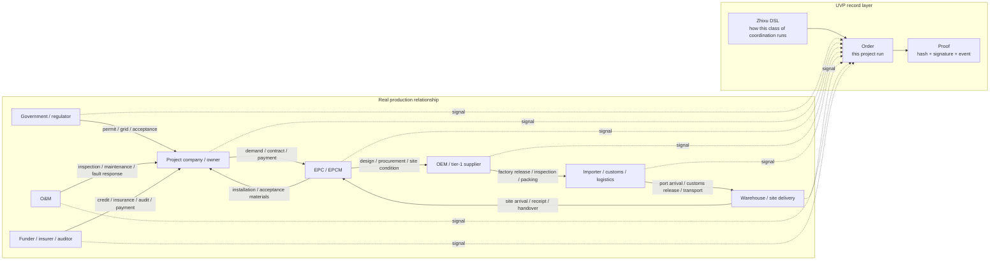
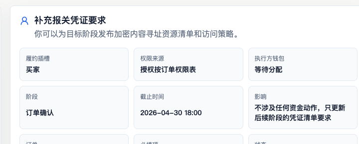

# One Order Story

> Prerequisite reading: [Coordination Infrastructure for the AI Era](why-uvp.md)
This page starts from a real production-relationship map, then moves into the order. Keep one sentence in mind first: Zhixu is the reusable rulebook for a class of coordination, and Order is one concrete execution of that rulebook.

The goal here is business intuition, not every engineering object. After this page, you should be able to explain who coordinates, who actually executes a step, which statement moves the order forward, and why those statements are accountable.

## 1. A Cross-Border PV Project Is a Production-Relationship Map

Take a Mongolia photovoltaic project as the example. For one project to land smoothly, it must pull policy approval, public EPC, the project company, EPC/EPCM, module and inverter OEMs, import customs declaration, port logistics, warehouse-to-site delivery, installation acceptance, O&M, funders, insurance, auditors, and regulators at the same time.

This kind of business is hard to summarize as "I have goods, you buy goods." It is closer to an interlocking production-relationship map: government permits affect EPC bidding. EPC demand affects OEM production scheduling. Factory documents affect customs declaration. Clearance status affects site installation. Installation records affect acceptance and payment. O&M records affect later responsibility.



Each solid line in the diagram is a real coordination relationship; each dotted line is a participant writing business progress as a UVP signal. UVP does not need to rebuild internal systems for every company; it unifies the key coordination boundaries into signals that can be signed, recorded, and held accountable.

## 2. Production Relationships Run on Signals

A production relationship runs because participants keep emitting signals:

- Government or regulators emit permits, filings, grid-connection, and acceptance signals.
- The project company emits demand confirmation, contract confirmation, and payment-arrangement signals.
- EPC/EPCM emits design confirmation, procurement instructions, and site-condition confirmation signals.
- OEMs emit final-spec, sample, tooling, pilot-run, factory-release, and inspection signals.
- Import and logistics parties emit packing, shipment, port arrival, customs release, warehousing, outbound, and site-arrival signals.
- O&M emits installation-complete, inspection, fault-response, and maintenance-complete signals.

A signal answers three questions: who completed what, whether the next step can begin, and who accepts responsibility for the statement.

In role terms, these production organizations are capable participants first. When one of them is selected or elected to handle a concrete Order stage, it becomes the Executor or submitter for that stage. A government, regulator, funder, insurer, auditor, customs broker, EPC, or OEM does not become a special UVP role just because of its industry name.

## 3. Why Signals Have Force

Signals have force because the real world gives them consequences. A payment certificate lets a supplier continue production. A regulatory permit lets a project move to the next stage. Customs documents let cargo be released. Acceptance confirmation starts payment or warranty responsibility. Insurance and audit records make risk computable.

UVP records protocol facts: an authorized subject signs a statement that a business signal has been emitted for a specific Order, stage, and evidence fingerprint. Real-world truth is declared by the responsible participant, or by the Executor selected or elected to handle that stage, through its own signal and accountability. Off-chain facts are declared by real-world responsible parties; the chain records those declarations, signatures, evidence fingerprints, and state consequences.

## 4. Zhixu DSL Writes Production Relationships as Code

The first core move in UVP is to write "production relationship + signal boundary" as a computer-readable rulebook. That rulebook is called `Zhixu`. Its written form is a coordination-oriented DSL whose practical shape is close to YAML conventions.

A PV delivery Zhixu can describe:

```text
who can start
which stages require which evidence
which participants can take which parts
which signals each stage receives
after which received signals the next task opens
which path handles failure, timeout, rejection, or reassignment
```

Zhixu is a standard language that lets computers, on-chain contracts, enterprise systems, AI agents, Store, Order App, and executor-kit understand the same coordination boundary. Real contracts keep defining business responsibility; Zhixu writes the coordination boundary as executable signal rules.

When continuing to the core objects, start with [Core Concepts Entry](../concepts/README.md) and [The Zhixu DSL](../concepts/core/zhixu.md).

## 5. From Rulebook to One Order

Going from one Zhixu to one runnable Order breaks into four actions.

### 5.1 Write How This Kind of Project Coordinates

The Nucleus first writes the general coordination method for PV project delivery as a Zhixu. In this story, read the Nucleus as the team or organization that owns this reusable operating model--for example a procurement operations team, an industry program organizer, or a platform-side workflow designer. It answers ordinary business questions: who starts first, what EPC waits for, when the OEM can ship, who gets notified after customs release, who can accept after site receipt, and which path handles failure or timeout. This step is not yet one specific project; it is only the operating rule for a class of projects.

### 5.2 Freeze the Rule Into a Version

The system checks and packages the Zhixu: once references are complete and stages and signals line up, it forms a stable version and its fingerprint. The same rule set always gets the same fingerprint; changes that alter coordination semantics get a new fingerprint. In later review, order registration, and accountability, everyone discusses this same version.

### 5.3 Publish the Version and Register Participant Identities

The Publisher signs the stable version with EIP-712 to publish it, and StateMachine records the Plan hash, metadata, and publisher as replayable events. After offline verification of participating organizations, the Store can write subject-to-wallet mappings into the Identity Registry, helping participants identify the real-world subject behind a wallet.

### 5.4 Create This Concrete Run

An Order is one concrete execution of a stable rule version. For example, when a Mongolia PV project actually procures a batch of modules and delivers them to site, the order creator signs trigger typed data to create the Order (there is no registrar allowlist), and writes who may submit which signals inside this Order.

```text
Zhixu DSL: how this class of PV project coordinates
  -> stable version and fingerprint: everyone points to the same rule set
  -> Plan publication record: the publisher signs this version
  -> Order: one project starts running under this version
  -> authorization table: who may emit which signal in this Order
```

From `OrderRegistered` onward, the business is no longer just a template. It becomes a concrete runtime that can be tracked, signed, supplied with evidence, used to open the next task, and replayed as proof.

How these four steps land on chain step by step (two-step Plan registration and finalization, identity registration, trigger and authorization writes) is covered in [the local-to-on-chain path](../concepts/lifecycle.md).

## 6. What Changes for Participants

For participants, daily work mostly keeps its existing shape. A manufacturer still finalizes specs, makes samples, opens tooling, runs pilots, and releases goods from the factory. A logistics provider still books shipment, ships, clears customs, and delivers. EPC still organizes design, procurement, installation, and acceptance.

UVP standardizes the signal boundary. When you complete an agreed action in a stage, you submit the evidence fingerprint as required and sign a signal with the authorized wallet. When other participants' signals arrive, UVP follows the Zhixu agreement and opens your ready task, notifying you that the next step can begin.

```text
instruction
  -> execution
  -> evidence fingerprint
  -> signed signal
  -> chain record and state progression
  -> next task
```

A complex production relationship compresses into one readable path: who was authorized, what was done, what evidence fingerprint was submitted, who signed, which chain event exists, and why the next step can begin.

Back in this PV Order, one pair of concepts must be separated: the customs service provider responsible for import clearance is the [Supplier](../concepts/core/supplier.md)--the capability and trust subject that undergoes material review; the operations wallet, employee wallet, or API wallet that actually submits the clearance-complete signal in the project is the [Executor](../concepts/core/executor.md) for this stage.

## 7. How a DSL Stage Becomes a Product Task

The DSL and the product UI use different words for the same path. On the first pass, read it as "when the conditions in the rule are satisfied, a handleable task appears in the product":

```text
stage condition in the Zhixu
  -> matching signal appears in the Order
  -> Product task opens
  -> participant submits evidence fingerprint and signature
  -> signal is recorded on chain
  -> proof row appears in Product / Store / Order App
```

How task and proof-row fields are projected from chain events is covered in [Product DTO](../concepts/product/dto.md).

Back in the PV project, this can look like:

- After the project company confirms procurement conditions, the OEM sees a "prepare factory-release materials" task.
- After the OEM submits evidence fingerprints for factory documents and packing lists, the import-clearance task opens.
- After the customs service provider submits the clearance-complete signal, warehousing and site-delivery tasks open.
- After site receipt and installation records arrive, tasks tied to acceptance, payment, or warranty responsibility continue.



*The Order App presents a handleable task as participant-readable deadline, input requirements, authorization source, and proof status; the screenshot comes from a local Order App run against a real Product API, and the business thread above remains the PV project.*

This means "the task is ready to handle," not "the business work is already complete." Completion must be proven later by follow-up authorized signals and evidence fingerprints.

## Read Next

- [Core Concepts](../concepts/README.md): read the protocol objects by layer after the story is clear.
- [Plan and the Order Lifecycle](../concepts/lifecycle.md): on the second pass, use the same order to see how code modules and product surfaces divide the work.
- [Glossary](../reference/glossary.md): consult it whenever you meet unfamiliar terms or key concept pairs.
