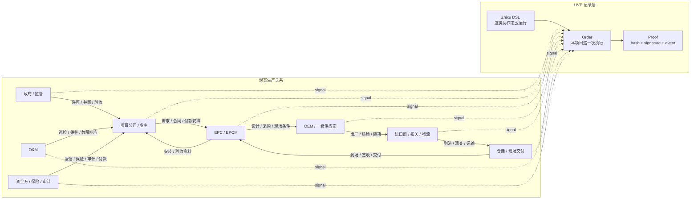

# 一个订单故事

这页先从一张真实生产关系图理解 UVP，再进入订单。先记住一句话：秩序 (Zhixu) 是一类协作的静态约定，订单 (Order) 是这份约定的一次具体执行。

## 1. 一个跨境光伏项目是一张生产关系图

以蒙古光伏项目为例，一个项目顺利落地，要同时牵动政策审批、公共 EPC、项目公司、EPC/EPCM、组件和逆变器 OEM、进口报关、口岸物流、仓储到现场、安装验收、O&M、资金方、保险、审计和监管。

这类生意很难用“我有货，你买货”概括。它更像一张互相依赖的生产关系图：政府许可影响 EPC 招标，EPC 需求影响 OEM 排产，出厂文件影响报关，清关状态影响现场安装，安装记录影响验收和付款，O&M 记录又影响后续责任。



图里的每条实线是现实协作关系，每条虚线是某个参与者把业务进展写成 UVP signal。UVP 不需要替每个企业重做内部系统；它把关键协作边界统一成可签名、可记录、可追责的信号。

## 2. 生产关系靠信号运转

生产关系能跑起来，是因为每个参与者不断发出信号：

- 政府或监管发出许可、备案、并网、验收等信号。
- 项目公司发出需求确认、合同确认、付款安排等信号。
- EPC/EPCM 发出设计确认、采购指令、现场条件确认等信号。
- OEM 发出定稿、打样、开模、小批量、出厂、质检等信号。
- 进口和物流参与方发出装箱、发运、到港、清关、入库、出库、到场等信号。
- O&M 发出安装完成、巡检、故障响应、维护完成等信号。

信号回答三个问题：谁完成了什么，下一步能不能开始，谁愿意为这个声明承担后果。

## 3. 信号为什么有用

信号有用，是因为现实社会给它后果。付款凭证让供应商继续排产，监管许可让项目进入下一步，报关材料让货物可以放行，验收确认让付款或质保责任开始，保险和审计记录让风险可以被计算。

UVP 记录协议事实：被授权的主体，在某个订单、某个阶段、某个证据指纹下，签名声明某个业务信号已经发出。现实真实性由对应的人、企业、trust domain、审计方、资金方、监管方或 adapter 发出自己的信号并承担责任。链下事实由现实责任主体声明，链上记录这些声明、签名、证据指纹和状态后果。

## 4. Zhixu DSL 把生产关系写成代码

UVP 的第一个核心动作，是把“生产关系 + 信号边界”写成计算机可读的秩序。这个秩序叫 `Zhixu`，写法是一个面向协作的 DSL，实际形式接近 YAML 约定。

一个光伏交付 Zhixu 会描述：

```text
谁可以开始
哪些阶段需要哪些证据
哪些 Supplier 可以承接哪些环节
每个阶段会接收什么 signal
收到哪些 signal 后，下一步 task 可以打开
失败、超时、拒绝或改派时走哪条路径
```

Zhixu 是一份让计算机、链上合约、企业系统、AI agent、Store、Order App 和 executor-kit 理解同一套协作边界的标准语言。现实合同继续约定商业责任，Zhixu 负责把协作边界写成可执行的信号规则。

继续读核心对象时，从 [核心概念入口](../core/README.md) 和 [秩序 (Zhixu) DSL](../concepts/core/zhixu.md) 开始。

## 5. 从 Zhixu 到 Plan，再到 Order

这一段可以拆成四个动作读。

### 5.1 先写“这类项目怎么协作”

凝结核先把光伏项目交付的通用协作方式写成 Zhixu。它回答普通业务问题：谁先开始，EPC 等什么，OEM 什么时候能发货，清关完成后谁收到通知，现场签收后谁可以验收，失败或超时时走哪条路。

这一步像把一套项目操作手册写成机器能读懂的 YAML。它还不是某一个具体项目，只是一类项目的运行规则。

### 5.2 再把规则固化成一个版本

compiler 的工作可以理解成“检查和打包”。它读取 Zhixu，检查引用是否完整、阶段和 signal 是否能对上、哪些条件会打开哪些任务，然后生成一个稳定版本。这个稳定版本叫 Plan。

Plan 有一个 `planHash`，可以把它理解成这份规则的指纹。同一份规则会得到同一个指纹；影响协作语义的改动会得到新的指纹。这样后面审查、注册订单、追责时，大家讨论的是同一个版本。

### 5.3 Trust domain 背书这个版本

trust domain 是愿意为某类判断提供背书的责任主体。它可以审查 Plan 对应的材料、证据要求、supplier 要求、适用范围和 `planHash`。审查通过后，它在链上发出 `PlanAttested`。

`PlanAttested` 的含义是：这个 trust domain 承认这个 Plan 版本符合它的背书口径。它给后续 Store 展示、订单创建和合作方判断提供可验证依据。

### 5.4 最后创建这一次执行

Order 是某个 Plan 的一次具体执行。比如某个蒙古光伏项目真的要采购一批组件并交付到现场，registrar 创建一个 Order，并写入本订单里谁能提交哪些 signal。

```text
Zhixu DSL: 这类光伏项目怎么协作
  -> Plan / planHash: 这套规则的稳定版本和指纹
  -> PlanAttested: 某个 trust domain 背书这个版本
  -> OrderRegistered: 某个项目开始按这个版本执行
  -> SignalSubmitterAuthorized: 本订单里谁能发什么 signal
```

从 `OrderRegistered` 开始，业务不再只是模板。它变成一次可以被跟踪、签名、提交证据、打开下一步任务并重放证明的具体运行。

## 6. 参与者的日常工作怎样变化

从参与者角度看，原来要做的工作基本保持不变：生产厂家仍然定稿、打样、开模、小批量和出厂；物流商仍然订舱、发运、清关和交付；EPC 仍然组织设计、采购、安装和验收。

UVP 标准化的是信号边界。你在某个阶段完成了约定动作，就按要求提交证据指纹，用授权钱包签名发出 signal。别人的 signal 到达后，UVP 按 Zhixu 的约定打开你的 ready task，通知你可以开始下一步。

```text
指令
  -> 执行
  -> 证据指纹
  -> 签名 signal
  -> SignalSubmitted
  -> HookReady
  -> 下一步任务
```

复杂生产关系被压缩成一条可读路径：谁被授权、做了什么、证据指纹是什么、签名是谁、链上事件是什么、下一步为什么可以开始。

## 接着读

- [角色地图](actor-map.md)：把光伏项目里的现实角色映射到 UVP 角色。
- [证据与 Proof 路径](evidence-proof-path.md)：看业务文件如何变成 hash、签名 signal、链事件和 Product proof row。
- [核心术语表](../reference/glossary.md)：遇到 Zhixu、Order、Signal、Hook、Trigger、Supplier、Executor 时随时查。
